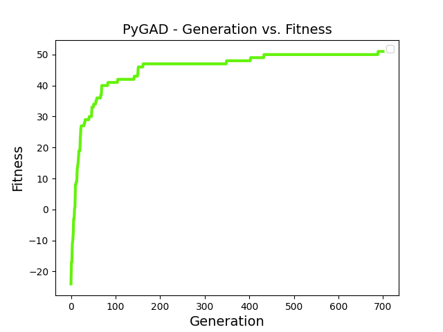

# Nonogram

In this project, the problem of the nonogram is presented.

A nonogram (painting by numbers) is a puzzle that involves shading cells of a grid. The shaded cells will form a picture. The numbers beside the grid indicate which cells need to be shaded. The numbers on the left side of each row specify how many groups of black cells are in that row and how many black cells are in each group. The numbers at the top of the grid work similarly.

The above problem was solved using a genetic algorithm (using 2 fitness functions) for three sizes: 5x5, 10x10, 15x15.

Additionally, a small application was written for the 5x5 nonogram.

For the above problem, binary genes were chosen, where 1 means a shaded cell, and 0 means an empty cell.

A helper function was used for the fitness function. This function counts the correct values and gives +1 point for each correctly guessed value and a penalty of -5 for each incorrect one. The main fitness function calls the helper function for each column and each row and sums the total fitness value (score).

Another program was also created with a different fitness function, which differs from the previous one in the penalty: this time, the penalty for incorrect guessing is -1 point.

To compare the results of the functions, 3 examples were used for each size. The results are represented in Table 1.

| Size  | Algorithm     | Statistic | Values                    | Average |
|-------|---------------|-----------|---------------------------|---------|
| 5x5   | nonogram_ga   | Accuracy  | 100.0, 100.0, 83.33       | 94.44   |
|       |               | Time      | 1.91, 1.60, 3.47          | 2.33    |
|       | nonogram_ga2  | Accuracy  | 100.0, 100.0, 83.33       | 94.44   |
|       |               | Time      | 10.33, 1.82, 3.18         | 5.11    |
| 10x10 | nonogram_ga   | Accuracy  | 70.37, 82.98, 92.68       | 82.01   |
|       |               | Time      | 23.98, 24.58, 26.17       | 24.91   |
|       | nonogram_ga2  | Accuracy  | 77.78, 87.23, 85.37       | 83.46   |
|       |               | Time      | 27.38, 32.27, 33.64       | 31.10   |
| 15x15 | nonogram_ga   | Accuracy  | 55.84, 70.59, 43.10       | 56.51   |
|       |               | Time      | 49.84, 102.65, 50.30      | 67.60   |
|       | nonogram_ga2  | Accuracy  | 66.23, 78.82, 50.00       | 65.02   |
|       |               | Time      | 55.45, 111.30, 52.62      | 73.12   |

Table 1: Results for different algorithms and nonogram sizes

### Learning Curves
For fitness 1:

### For fitness 1:

#### 5x5 Examples

    
    
    

#### 10x10 Examples

    
    
    

#### 15x15 Examples

    
    
    

### For fitness 2:

### For fitness 2:

#### 5x5 Examples

    
    
    

#### 10x10 Examples

    
    
    

#### 15x15 Examples

    
    
    

## Aplication

Also for problem 5x5 writed an aplication. Go into `server` folder, write in terminal `python main.py` and aplication will be avaible on `http://localhost:5000`

    

Write numbers and see the resul:

    

